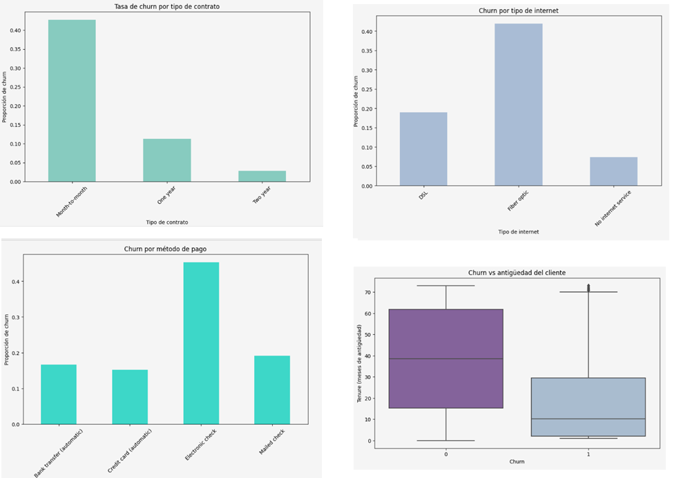

<p align="center">
  
</p>

# 📊 Customer Churn Prediction

Machine Learning project that predicts customer churn in the telecommunications industry using classification models and business-oriented performance metrics.

---

## 📌 Project Summary

This project focuses on predicting customer churn for a telecommunications company. The objective was to identify customers at high risk of cancelling their service so the company can implement proactive retention strategies.

The project includes data integration, exploratory data analysis, feature engineering, model comparison, hyperparameter optimization, and business-oriented evaluation to select the most suitable predictive model.

---

## 🏆 Key Results

- **Best Model:** CatBoost (Balanced)
- **ROC-AUC:** **0.90**
- **F1-score:** **0.69**
- Compared **10 different modeling strategies**
- Evaluated Logistic Regression, Random Forest and CatBoost models
- Selected the final model based on predictive performance and business applicability

---

## 💼 Business Problem

Customer acquisition is considerably more expensive than customer retention. Being able to identify customers likely to leave the service allows companies to implement targeted retention campaigns before cancellation occurs.

The goal was to develop a classification model capable of identifying customers with high churn probability while minimizing false negatives.

---

## 📂 Dataset

The analytical dataset was built by integrating multiple sources:

- Customer contracts
- Personal information
- Internet services
- Telephone services

The project included data cleaning, preprocessing, handling missing values and feature engineering before model development.

---

## ⚙️ Technologies

- Python
- pandas
- NumPy
- Matplotlib
- Scikit-learn
- CatBoost
- Machine Learning

---

## 🔬 Project Workflow

- Data Cleaning
- Exploratory Data Analysis (EDA)
- Feature Engineering
- Data Preprocessing
- Model Training
- Hyperparameter Optimization
- Model Comparison
- Performance Evaluation
- Business Interpretation

---

## 🤖 Models Evaluated

The following models were trained and compared:

- Logistic Regression
- Logistic Regression (Balanced)
- Logistic Regression + Threshold Optimization
- Random Forest
- Random Forest (Balanced)
- Random Forest (Optimized)
- CatBoost
- CatBoost (Balanced)
- CatBoost (Optimized)
- Dummy Classifier (Baseline)

Model performance was evaluated using:

- F1-score
- Accuracy
- ROC-AUC

---

## 📈 Model Selection

Ten different modeling strategies were evaluated to identify the most effective solution.

Among all tested approaches, **CatBoost with class balancing** achieved the best overall performance, providing the best balance between predictive accuracy, robustness and business applicability.

The final model reached:

- **ROC-AUC:** **0.90**
- **F1-score:** **0.69**

These results demonstrate strong predictive capability while maintaining good generalization performance.

---

## 💡 Business Impact

This solution enables the company to proactively identify customers at risk of churn and prioritize retention efforts.

Potential business benefits include:

- Reduced customer attrition
- Lower customer acquisition costs
- More efficient retention campaigns
- Better allocation of marketing resources

---

## 📁 Repository Structure

```
customer-churn-prediction
│
├── customer_churn_prediction.ipynb
├── README.md
└── cover.png
```

---

## 👩‍💻 Author

**Paola Romero**


Data Analyst | Business Intelligence | Data Science

📁 Portfolio  
https://paolaromerop.github.io/paola-portafolio/

💼 LinkedIn  
https://www.linkedin.com/in/paolaromerop/

---

Developed as the capstone project for the TripleTen Data Science Bootcamp, applying end-to-end machine learning techniques to solve a real-world business problem.
